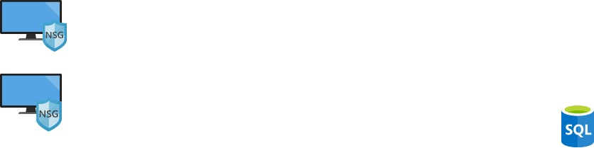

# Azure-Honeynet-SOC
 
 Currently under construction...

This project showcases a live honeynet/SOC environment hosted within Microsoft Azure using several of its services like Entra ID, Sentinel, and Virtual Machines.
This simulation aims to mimic a corporate environment and the potential attack vectors its network can be prone to.

